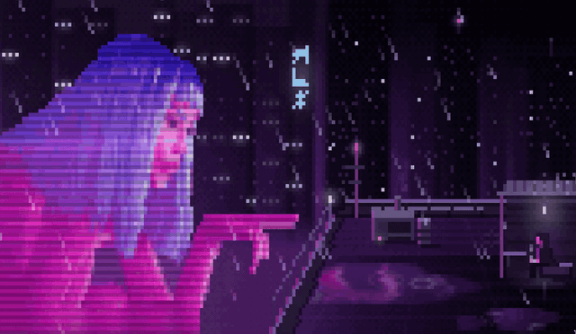

# Blade Runner

K on the rooftop, looking at JOI: the Blade Runner 2049 scene as animated pixel art in the terminal.

A rainy night rooftop with a giant hologram of JOI, a city of towers, neon signs and passing ships, puddles that
reflect everything, and K smoking under a canopy, walking over to JOI, talking, and coming back.

<p align="center">
  
</p>

## Running

```sh
python3 br.py
```

Press `Ctrl+C` to quit.

- Python 3.11 or newer, standard library only.
- A terminal with true color (24-bit) support.
- At least 60x16 cells; it looks best at 200x50 or larger. Resizing while it runs is fine.

## How it works

Each terminal cell is a `▀` character holding two pixels: the top one is the foreground color and the bottom one
is the background. The scene is drawn as a pixel grid and the engine turns it into ANSI escape codes, using
synchronized output to avoid flicker.

The film frame is 2.4:1 and everything is defined in reference coordinates (200x83 pixels), then scaled to the
terminal. If the terminal is taller than the film's aspect ratio, the city grows to fill the extra space above
and below the frame. Every frame is a function of the tick, so the animation survives terminal resizes.

## Project layout

The code lives in `modules/`, split in layers. Dependencies only point inward: `core` imports nothing from the
project, and `terminal` knows nothing about the scene. `br.py` is the only place that wires them together.

```
br.py                       entry point: builds the Scene and hands it to the render loop
assets/joi.jpg              source image for JOI's sprite (only read by tools/)
modules/
  core/                     pure domain, no I/O
    color.py                Color, Frame, blend, scale, interpolate
    timing.py               frame interval, seconds to ticks, per-period seeded RNG
  graphics/                 drawing primitives
    canvas.py               pixel grid mapped to the 200x83 reference frame, blinking lights
    sprite.py               sprite grids and rescaling
  characters/               the characters as data and behavior, independent of painting
    k/sprites.py            K's sprites and poses
    k/behavior.py           K's loop: smoke, stand, walk to JOI, talk, walk back, sit
    joi/sprite.py           JOI's sprite, generated from assets/joi.jpg (do not edit by hand)
    joi/blink.py            JOI's blink
  scene/                    each layer paints its part onto the shared canvas
    scene.py                composes the layers in order (the composition root of the scene)
    layout.py               positions in reference coordinates and shared colors
    background.py           fog, wet floor and Bayer dithering
    city.py                 towers, windows, neon signs, blurred lights, ships, balcony and footer
    rooftop.py              back wall, pipe, antenna, air conditioner, barrel, chimney steam
    canopy.py               K's canopy, bench, shelf and the drips from its eave
    puddles.py              puddles reflecting JOI, the skyline and K, with ripples
    hologram.py             JOI's hologram: pulse, scanlines, glitches, blink, hair in the wind
    k.py                    K painted: light, shadow, haze, reflection, cigarette and smoke
    rain.py                 raindrops, splashes and puddle ripples
    effects.py              smoke puffs and points of light shared by several layers
  terminal/                 infrastructure
    ansi.py                 true-color "▀" encoding
    screen.py               writes frames, redrawing only the rows that changed
    loop.py                 the render loop, resize handling and the minimum size
tools/extract_joi.py        regenerates modules/characters/joi/sprite.py from assets/joi.jpg
```

## Regenerating the hologram

The program never reads the image; it only uses the sprite in `modules/characters/joi/sprite.py`. To rebuild
it from `assets/joi.jpg`
(requires [ImageMagick](https://imagemagick.org)):

```sh
python3 tools/extract_joi.py
```

The frame is reduced to 200x83 pixels, the hologram is cut out with a brightness mask, and its colors are
quantized into a small palette.

## Development

Linting uses [Ruff](https://docs.astral.sh/ruff/), configured in `pyproject.toml`:

```sh
ruff check .
ruff format .
```
